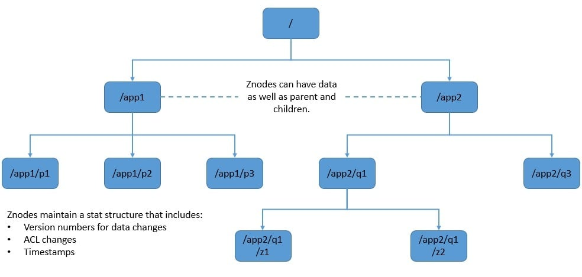
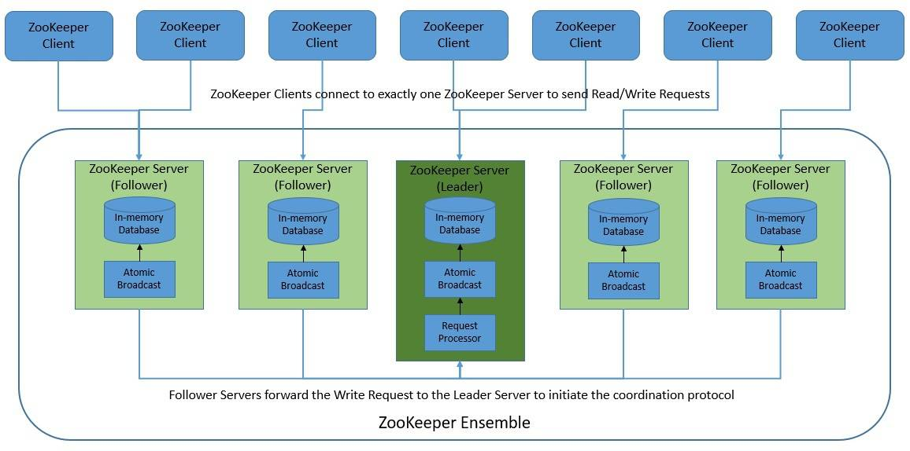
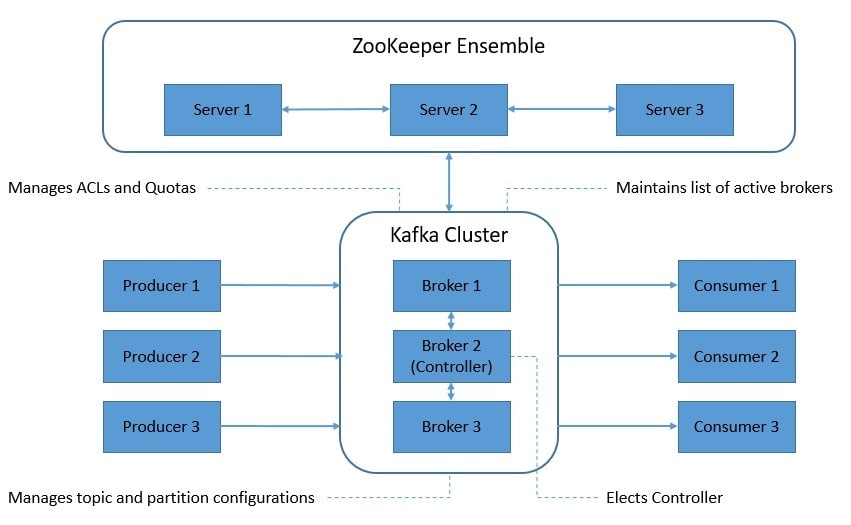
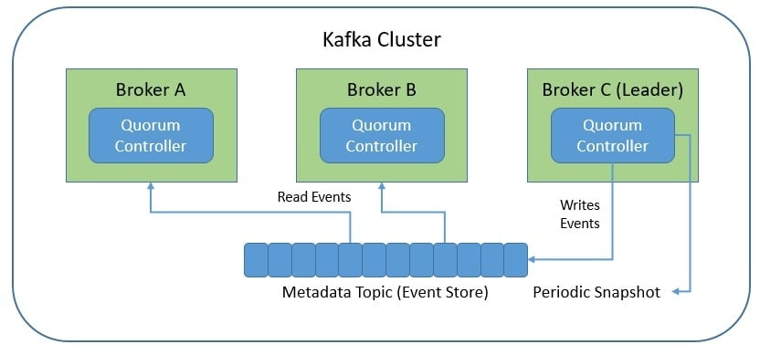

[GET STARTED LINK](https://kafka.apache.org/intro)

### **Kafka's Key Advantages**
---
- **Decoupling:** Producers and consumers don’t need to know about each other.
- **Scalability:** Can handle large volumes of data efficiently.
- **Durability:** Ensures data is not lost, even if a broker fails.
- **Real-time Processing:** Enables real-time data streaming and analysis.

### Zookeeper vs KRaft
---
**Zookeeper** 

> 3 types of znodes
     - Persistent
     - Ephemeral: Delete on session disconnect, no child
     - Sequential: id, etc...

**Zookeeper servers are scalable**

> Clients can failover to another

**With Fakfa**

> Help kafka coordinate multiple decisions
     - Metadata management
     - Controller election
     - Cluster membership (eph znode)
     - Topic config (per-topic/global, list, n-partitions per topic, replica locations)
     - ACL to topics ( + consumer groups list, group members list)
     - Quota (client bandwidth, CPU utilization)

**Problem🎵**
- The added layer of management is a major caveat
- Take, for instance, `MongoDB`, `Cassandra`, `ElasticSearch` -> no dependency *Mongo is distributed?? Holy 🐟*
- In short, you'd be running a duplex distrib system 😱

**Enter, KRaft 👏🏻**

- Leader quorum controller creates metadata topic 🦜
- Others follow suit by subbing to that topic 
- This consensus protocol esnures metadata ubiquity ⚖
- Don't need to load state from ZooKeeper 🦍🦏
- Single security model for the whole system ☝🏻
- == QoL improved 💯

**Deprecation 👋🏻**
- Not dependent on Zookeeper since 2.8 (early access)
- It is announced to be deprecated on Fakfa 4.0 forward

### Comparison
---

> Operational charge method and cost vary by service

|  | Kafka | Kinesis | RabbitMQ | Pulsar | Redis Streams | Pub/Sub | Event Hubs |
|---|---|---|---|---|---|---|---|
| Managed         |🟢|🟢|🟢|🟢|🟢|🟢|🟢|
| Open Source     |🟢|🔴|🟢|🟢|🟢|🔴|🔴|
| Scalable        |🟢|🟢|🟡|🟢|🟡|🟢|🟢|
| Community       |1️⃣|5️⃣|2️⃣|3️⃣|4️⃣|6️⃣|7️⃣|
| Operation Cost  |😨|😬|😊|💀|😋|🤔|🤨|

